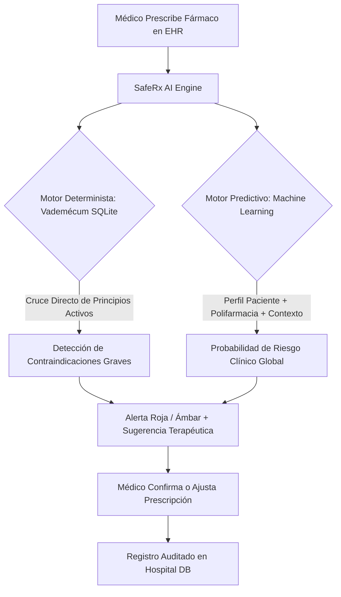

# SafeRx AI — Definición Estratégica de la Startup

**Proyecto:** SafeRx AI (Safe Prescription Artificial Intelligence)  
**Sector:** HealthTech / Clinical Decision Support Systems (CDSS)  
**Versión:** 1.0  
**Fecha:** Septiembre 2026  

---

## 1. Resumen Ejecutivo

**SafeRx AI** es una plataforma de inteligencia clínica basada en Inteligencia Artificial y reglas farmacológicas en tiempo real diseñada para erradicar las reacciones adversas prevenibles por polifarmacia e incompatibilidad de medicamentos en redes hospitalarias y centros de atención primaria.

Integrándose de forma nativa en los sistemas de historia clínica electrónica (EHR/HIS), SafeRx AI actúa como un **copiloto de prescripción segura**, analizando de forma simultánea el perfil del paciente (edad, comorbilidades, función orgánica), su historial de medicación activa y los nuevos fármacos prescritos, alertando instantáneamente sobre interacciones potencialmente letales y sugiriendo alternativas terapéuticas seguras.

---

## 2. Misión, Visión y Principios

### Misión
Proteger la vida de los pacientes y empoderar a los profesionales de la salud mediante tecnología de decisión clínica instantánea, reduciendo a cero los eventos adversos farmacológicos prevenibles y devolviendo tiempo valioso a la relación médico-paciente.

### Visión
Convertirnos en el estándar de oro de interoperabilidad e inteligencia farmacológica en los sistemas hospitalarios de Europa y Latinoamérica para 2030, respaldando más de 50 millones de prescripciones seguras al año.

### Principios Fundamentales
1. **Seguridad del Paciente Primero:** La sensibilidad clínica prima sobre la exactitud genérica; ningún riesgo potencialmente letal debe pasar desapercibido.
2. **Cero Fatiga de Alertas (*Zero Alert Fatigue*):** Notificar únicamente ante riesgos reales y accionables, con explicaciones fundamentadas en evidencia médica.
3. **Privacidad y Soberanía de Datos:** Cumplimiento estricto de los marcos regulatorios sanitarios internacionales (RGPD y estándares de salud digital).
4. **Fricción Cero en Consulta:** Tiempos de respuesta de inferencia inferiores a 200 milisegundos para no interrumpir el flujo del facultativo.

---

## 3. El Problema de Mercado

### 3.1. La Crisis Silenciosa de la Polifarmacia
El envejecimiento poblacional ha disparado la prevalencia de enfermedades crónicas. En pacientes mayores de 65 años, la media de ingesta se sitúa entre **4 y 7 fármacos diarios (polifarmacia)**.
* Matemáticamente, verificar las combinaciones de 5 fármacos requiere contrastar 10 pares cruzados; con 7 fármacos, 21 pares.
* En una consulta ambulatoria o de urgencias que dura entre 10 y 15 minutos, este cálculo manual es **físicamente inviable**.

### 3.2. Consecuencias Sanitarias y Financieras
* **Pérdida de Tiempo Asistencial:** Los facultativos pierden entre 3 y 5 minutos por paciente buscando interacciones en manuales físicos o buscadores genéricos.
* **Morbilidad y Mortalidad Evitable:** Las interacciones adversas a medicamentos (ADRs) representan la 4ª a 6ª causa de muerte hospitalaria en países desarrollados.
* **Costes Legales y Primas de Aseguramiento:** Incidentes como hemorragias masivas por *Aspirina + Warfarina* o insuficiencias renales agudas por *AINEs + IECAs* derivan en litigios por mala praxis médica y aumentos directos del 15% o más en las primas de seguro de responsabilidad civil para los hospitales.

---

## 4. La Solución: SafeRx AI

SafeRx AI opera a través de un **Motor Dual de Decisión Clínica**:

1. **Capa Determinista (Reglas Clínicas):** Base de datos farmacológica estructurada que detecta de inmediato incompatibilidades absolutas con evidencia médica contrastada (gravedad leve, moderada o grave).
2. **Capa Predictiva (IA/ML):** Modelo entrenado con históricos clínicos que pondera la edad del paciente, patologías previas (hipertensión, insuficiencia), número de medicamentos concurrentes y condiciones de la atención (ej. guardias de urgencias) para emitir un score probabilístico de riesgo.
3. **Recomendación Terapéutica Asistida:** Sugiere sustitutos de menor riesgo (por ejemplo, alternativas analgésicas ante el uso de anticoagulantes).

---

## 5. Modelo de Negocio

SafeRx AI se comercializa bajo un modelo **B2B SaaS (Software as a Service) Sanitario**:

### 5.1. Estructura de Precios (Tiers)
* **Tier Essential (Clínicas y Centros Médicos Locales):**
  * Tarifa mensual fija por médico activo: **€49 / médico / mes**.
  * Incluye motor determinista de vademécum y alertas en tiempo real.
* **Tier Enterprise Hospitalario (Redes Hospitalarias y Grandes Grupos):**
  * Tarifa anual calculada por volumen de camas o consultas atendidas (ej. **€0.08 - €0.15 por consulta analizada**).
  * Incluye integración directa HL7/FHIR con el EHR del hospital, modelo predictivo de riesgo IA personalizado, panel de analítica hospitalaria y soporte 24/7.
* **Módulos Adicionales:**
  * Auditoría predictiva de pólizas de mala praxis para compañías aseguradoras de salud.

### 5.2. Retorno de Inversión (ROI) para el Cliente
Tomando como referencia el caso de nuestro cliente piloto, el **Grupo Hospitalario San José**:
* **Ahorro de Tiempo Médico:** 3,000 consultas/día × 3 minutos ahorrados = **150 horas médicas/día recuperadas**, equivalentes a una capacidad de atención adicional de más de 600 pacientes diarios sin contratar personal extra.
* **Ahorro en Seguros y Litigios:** Reducción estimada de 12 incidentes graves anuales, logrando un ahorro de hasta **€180,000 anuales** en indemnizaciones y reducción directa de la prima de seguro de mala praxis (-15%).

---

## 6. Arquitectura Tecnológica y Seguridad

* **Frontend:**
  * Landing page institucional y portal comercial: Next.js 14, Tailwind CSS, Lucide Icons, diseño Bento Grid y soporte bilingüe.
* **Prototipo Clínico / Backend:**
  * Aplicación clínica interactiva en Python + Streamlit (`prototype/app.py`).
  * Conexión con base de datos relacional SQLite/PostgreSQL (`database/hospital.db`).
* **Inteligencia Artificial y Modelado:**
  * Pipeline de datos y feature engineering en Python (`src/data_preprocessing.py`).
  * Modelos predictivos entrenados y serializados (`Random Forest`, `Logistic Regression` con balanceo de clases) en `prototype/models/`.
* **Privacidad y Cumplimiento:**
  * Diseñado bajo el principio de *Privacy by Design* conforme al Reglamento General de Protección de Datos (RGPD) de la UE.
  * Trazabilidad completa y auditoría de cada alerta mostrada y descartada por los facultativos.

---

## 7. Roadmap de Desarrollo

| Fase | Periodo | Hitos Principales | Estado |
| :---: | :---: | :--- | :---: |
| **Fase 1** | Q3 2026 | Arquitectura de base de datos clínica, ingesta de datos reales (OpenFDA FAERS) y vademécum. |  Completado |
| **Fase 2** | Q3 2026 | Landing page institucional, pipeline de preprocesamiento y notebooks de análisis (EDA). |  Completado |
| **Fase 3** | Q3 2026 | Modelado de riesgo con Scikit-Learn y prototipo clínico funcional en Streamlit. |  Completado |
| **Fase 4** | Q4 2026 | Piloto en entorno real en 1 hospital regional del Grupo Hospitalario San José. |  Siguiente Paso |
| **Fase 5** | Q1 2027 | Conectores interoperables FHIR / HL7 y certificación CE como producto de software sanitario. | 📋 Planificado |
